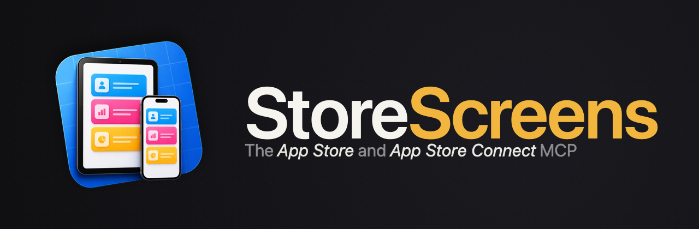

# storescreens-skill

Agent skill for [storescreens-cli](https://github.com/ciscoriordan/storescreens-cli), the CLI that captures App Store screenshots across every required device size, renders them into captioned, framed App Store-ready images, and uploads them (with per-locale metadata) straight to App Store Connect, in one command.

This skill lets an AI coding assistant handle the entire pipeline: installing the CLI, detecting your Xcode project, configuring devices, generating UI tests, running captures, installing device bezels, writing a `render:` config that produces captioned/framed App Store Connect-ready screenshots, configuring the App Store Connect API, and pushing screenshots + per-locale metadata (name, subtitle, description, keywords, what's new, promotional text) to App Store Connect for the next release. It also supports **targeted screenshots** for quick visual checks during development, capturing the current simulator screen in under a second without building or running tests.

## Prerequisites

The skill installs [storescreens-cli](https://github.com/ciscoriordan/storescreens-cli) via Homebrew automatically if it's not already on your machine. You need **macOS 14+** and **Xcode 16+**.

## Install

### One-liner via [skills.sh](https://skills.sh)

The easiest way. The [`skills`](https://github.com/vercel-labs/skills) CLI from Vercel Labs will detect this repo's `SKILL.md` and install it into the right location for your assistant (Claude Code, Cursor, or any other supported tool):

```bash
npx skills add ciscoriordan/storescreens-skill
```

Update later with:

```bash
npx skills update ciscoriordan/storescreens-skill
```

### Claude Code (manual)

Clone the skill into your user-level skills directory to make it available in every project:

```bash
git clone https://github.com/ciscoriordan/storescreens-skill.git \
  ~/.claude/skills/storescreens
```

Or install per-project by cloning into the project's `.claude/skills/` directory:

```bash
cd /path/to/your/xcode-project
git clone https://github.com/ciscoriordan/storescreens-skill.git \
  .claude/skills/storescreens
```

Update later with:

```bash
git -C ~/.claude/skills/storescreens pull
```

Restart Claude Code after installing. The skill should then appear when you run `/skills` or when an applicable request triggers it (for example, "set up App Store screenshots").

### Other AI coding assistants

For any assistant that supports skill files or custom instructions, point it at `SKILL.md` from this repo, or load `storescreens.skill` (a packaged archive of the skill) as a skill package. Works with any assistant that can read skill definitions.

## What the Agent Does

1. Installs [storescreens-cli](https://github.com/ciscoriordan/storescreens-cli) (and `storescreens-mcp`) if needed
2. Detects the Xcode project and scheme
3. Generates `storescreens.yml` with the right devices for all required App Store sizes
4. Sets up a UI test target and `ScreenshotTests.swift` with navigation for each screen
5. Configures screenshot mode in the app (pro access, disabled animations, sample data)
6. Adds accessibility identifiers for reliable element targeting
7. Runs preflight checks - errors and warnings are surfaced before capture, with a prompt to fix or continue
8. Runs capture (via MCP tools when available, CLI otherwise)
9. Walks you through a `render:` block for App Store-ready framed/captioned screenshots: background (solid, gradient, or panoramic image sliced across all slides), optional scrim, logo, device chrome (none / stroke / bezel), and markdown captions with per-slide highlights
10. Guides you through `storescreens bezels import` - mounting Apple Design Resource DMGs and installing bezel assets
11. Iterates on caption/color/font changes via `storescreens render` without re-running a full capture
12. Configures the App Store Connect API (`storescreens auth login`, `.p8` key, env vars) and uploads rendered screenshots + per-locale metadata (description, keywords, release notes, promotional text, privacy URL) to App Store Connect via `storescreens submit`, optionally auto-submitting the version for App Review
13. Seeds non-base metadata locales from a base locale with a bring-your-own DeepL key (`storescreens translate`), re-translating only what went stale and QA-passing the machine output before submit
14. Troubleshoots failures using build logs

## MCP Server

When `storescreens-mcp` is configured in `.mcp.json`, the agent uses structured MCP tools instead of Bash calls. This gives it per-screenshot progress inline and structured results without requiring it to parse terminal output.

Available tools:

| Tool | Description |
|------|-------------|
| `capture` | Start full App Store screenshot capture in background |
| `get_capture_status` | Poll progress for a running capture |
| `get_capture_result` | Fetch full manifest once capture is complete |
| `take_screenshot` | Capture current simulator screen and return image inline (<1 second) |
| `check` | Run preflight scan for common issues |
| `list_simulators` | List available simulators grouped by App Store slot |
| `list_screenshots` | List screenshots from the last capture |
| `get_screenshot` | Load a saved PNG as inline image |
| `read_config` / `write_config` | Read or write `storescreens.yml` |

See [storescreens-cli](https://github.com/ciscoriordan/storescreens-cli#agent-skill) for setup instructions.

## Works with Xcode MCP (Xcode 26.3+)

StoreScreens complements [Xcode's built-in MCP server](https://developer.apple.com/documentation/xcode/giving-agentic-coding-tools-access-to-xcode). When both are available, the agent picks the right tool for each situation:

| Tool | What it captures | When to use |
|------|-----------------|-------------|
| Xcode `RenderPreview` | A single SwiftUI `#Preview` | Checking an individual view's layout. No simulator needed. |
| StoreScreens `take_screenshot` | The full running app in a simulator | Checking the app with real data, navigation, and system chrome. |
| StoreScreens `capture` | Full App Store screenshots | Final screenshots across multiple devices, locales, and appearances. |

## Contents

- **`SKILL.md`** - Step-by-step instructions for the agent
- **`storescreens.skill`** - Packaged skill archive (SKILL.md + references + assets)
- **`references/config-reference.md`** - Top-level `storescreens.yml` config schema (devices, locales, test target, etc.)
- **`references/render-reference.md`** - Full `render:` schema: background (including panoramic slicing), scrim, logo, caption (fonts, markdown, highlights), chrome (stroke / bezel), bezel install flow, caption shorthands, and a complete example
- **`references/submit-reference.md`** - Full App Store Connect upload schema: `app_store_connect:` block, `submit:` sub-block, credential resolution (env + `~/.storescreens/asc-credentials.yml`), `metadata/<locale>/*.txt` file layout and ASC field mapping, destructive upload semantics, troubleshooting, and a complete example
- **`references/upload-build-reference.md`** - Full `upload_build:` schema: archiving, `.ipa` export, `altool` upload to App Store Connect / TestFlight, auto-versioning, non-beta Xcode auto-selection, and troubleshooting
- **`assets/ScreenshotTests.swift.template`** - Starter XCUITest template. Mirrored from `storescreens-cli`'s `Resources/` on every release so it stays in sync with the CLI's expected cache-path contract.

## Related

- [storescreens-cli](https://github.com/ciscoriordan/storescreens-cli) - The CLI tool this skill automates

## License

[MIT](LICENSE) &copy; 2026 Francisco Riordan
